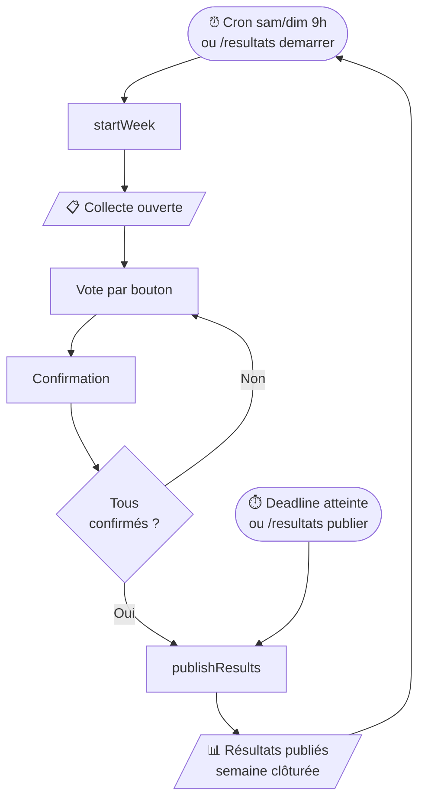
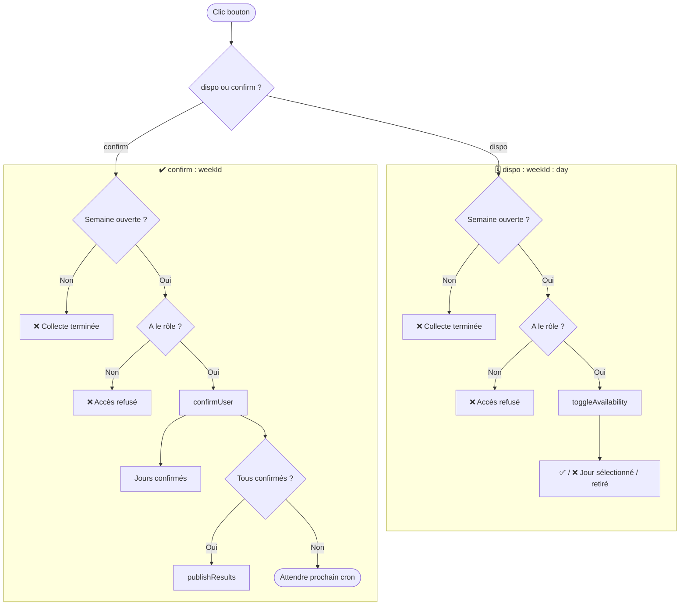
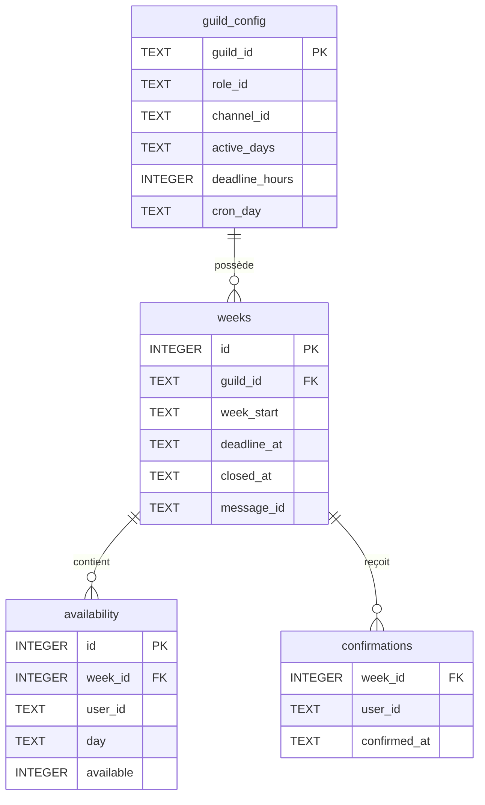

# Discord Dispo Bot

Bot Discord de collecte hebdomadaire des disponibilités. Poste automatiquement un message interactif chaque semaine, collecte les réponses via boutons, et publie un récapitulatif une fois tout le monde confirmé (ou à l'échéance).

## Fonctionnement

1. Chaque samedi (ou dimanche) à 9h00 (Paris), le bot poste un message dans le channel configuré.
2. Les membres du rôle cible cliquent sur les jours où ils sont disponibles (multi-sélection, réponse modifiable).
3. Chaque membre confirme ses choix via le bouton **✔️ Confirmer mes disponibilités**.
4. Dès que tous ont confirmé **ou** que la deadline est atteinte, les résultats sont publiés automatiquement.





## Prérequis système

- **Node.js v22+**
  - Vérifier : `node -v`
  - Installer via [nvm](https://github.com/nvm-sh/nvm) : `nvm install 22 && nvm use 22`
- **pnpm** : `npm install -g pnpm`
- **macOS** : Xcode Command Line Tools requis pour compiler `better-sqlite3`
  ```bash
  xcode-select --install
  ```
- Un bot Discord avec les permissions : `bot`, `applications.commands`
- Intents activés dans le portail développeur : **Server Members Intent**

## Installation complète

### 1. Cloner et installer les dépendances

```bash
git clone <repo>
cd discord-dispo-bot
pnpm install
```

### 2. Compiler les bindings natifs

`better-sqlite3` est un module C++ — doit être compilé pour votre version de Node.js.

```bash
pnpm run sqlInstall
```

### 3. Configurer les variables d'environnement

```bash
cp .env.example .env
```

Éditer `.env` :

```env
DISCORD_TOKEN=your_bot_token
CLIENT_ID=your_application_id
```

- `DISCORD_TOKEN` : token du bot (onglet *Bot* du portail développeur)
- `CLIENT_ID` : Application ID (onglet *General Information*)

### 4. Déployer les slash commands

À faire une fois, ou après ajout/modification d'une commande.
> ⚠️ Les commandes globales peuvent prendre jusqu'à 1h à apparaître sur Discord.

```bash
pnpm run deploy
```

### 5. Lancer le bot

```bash
# Développement (hot-reload)
pnpm run dev

# Production sans PM2
pnpm start

# Production (PM2)
pm2 start ecosystem.config.js
pm2 save
```

Le bot affiche `Connecté en tant que <nom-du-bot>` au démarrage.

## Commandes

### `/config` — admin uniquement (`ManageGuild`)

Sans option → affiche la config actuelle. Avec options → met à jour les paramètres (combinables).

| Option | Description | Valeurs |
|---|---|---|
| `role` | Rôle cible des membres | `@role` |
| `channel` | Channel de collecte | `#channel` |
| `jours` | Jours actifs | `lun,mar,jeu` (FR ou EN) |
| `deadline` | Heures avant fermeture auto | `1–336` |
| `cron-day` | Jour de lancement automatique | `Samedi` / `Dimanche` |

Alias jours acceptés : `lun/lundi/mon/monday`, `mar/mardi/tue/tuesday`, `mer/mercredi/wed/wednesday`, `jeu/jeudi/thu/thursday`, `ven/vendredi/fri/friday`, `sam/samedi/sat/saturday`, `dim/dimanche/sun/sunday`

Exemple — tout configurer en une commande :
```
/config role:@Équipe channel:#général jours:lun,mar,mer,jeu,ven,sam,dim deadline:48 cron-day:Samedi
```

### `/resultats` — admin uniquement (`ManageGuild`)

| Sous-commande | Description |
|---|---|
| `publier` | Force la publication des résultats de la semaine en cours |
| `demarrer` | Lance manuellement la collecte de la semaine prochaine |

### `/apercu` — admin uniquement (`ManageGuild`)

Affiche un embed avec les votants par jour pour la semaine en cours (ou la dernière semaine si clôturée). Inclut tous les votes, même non confirmés.

## Base de données

SQLite (`data/bot.db`), créée automatiquement au démarrage.

| Table | Contenu |
|---|---|
| `guild_config` | Config par serveur (rôle, channel, jours, deadline, cron) |
| `weeks` | Semaines de collecte (dates, deadline, statut) |
| `availability` | Réponses par membre et par jour |
| `confirmations` | Confirmations finales par membre |



## Structure du projet

```
src/
├── index.js              # Point d'entrée, chargement events/commands
├── commands/
│   ├── config.js         # /config
│   ├── resultats.js      # /resultats
│   └── apercu.js         # /apercu
├── events/
│   ├── ready.js          # Cron sam/dim 09h00 Paris + check deadlines toutes les 15 min
│   └── interactionCreate.js
├── handlers/
│   ├── commandHandler.js
│   └── buttonHandler.js  # Toggle dispo + confirmation
├── tasks/
│   └── weeklyTask.js     # startWeek, publishResults, checkCompletion
├── utils/
│   └── results.js        # Embeds collect + résultats + détail
└── db/
    ├── index.js           # Connexion SQLite (WAL, FK ON)
    ├── schema.sql
    └── queries.js
deploy-commands.js         # Enregistrement global des slash commands
ecosystem.config.js        # Config PM2
```

## Valeurs par défaut

| Paramètre | Défaut |
|---|---|
| Jours actifs | Lundi → Dimanche (7 jours) |
| Deadline | 48h |
| Jour de lancement | Samedi |

## Dépendances

| Package | Usage |
|---|---|
| `discord.js` v14 | Client Discord, slash commands, boutons, embeds |
| `better-sqlite3` | Base de données SQLite synchrone |
| `node-cron` | Tâches cron (lancement hebdo + check deadlines) |
| `dotenv` | Variables d'environnement |

## Troubleshooting

### `Error: Could not locate the bindings file` (better-sqlite3)

```bash
pnpm run sqlInstall
```

Si `gyp` introuvable (macOS) :
```bash
xcode-select --install
pnpm run sqlInstall
```

Si l'erreur persiste, vérifier que Node.js v22 est utilisé :
```bash
nvm install 22 && nvm use 22
pnpm install && pnpm run sqlInstall
```

### Commandes non visibles après `pnpm run deploy`

Propagation globale Discord — attendre jusqu'à 1h.
